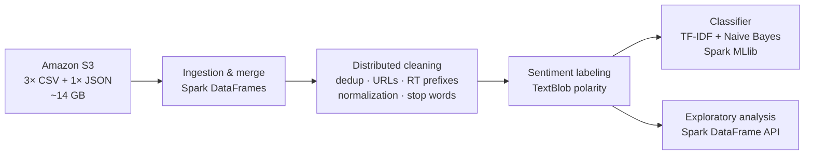
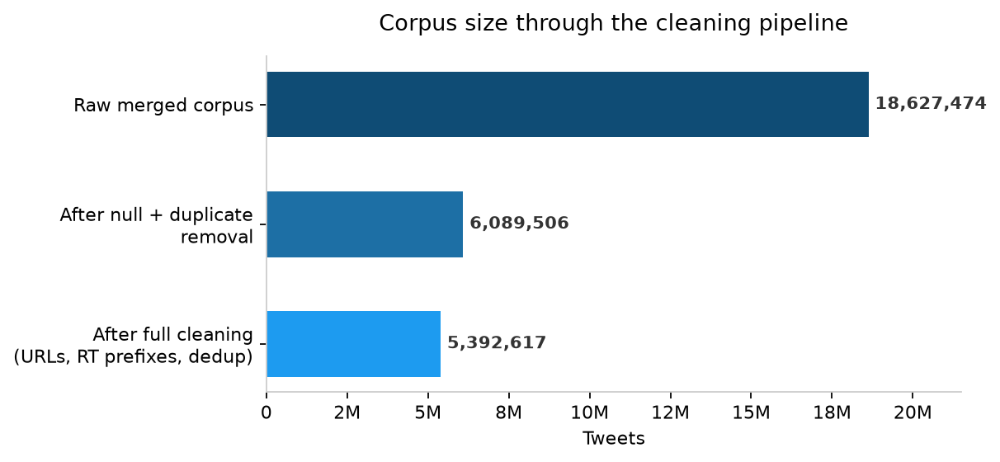
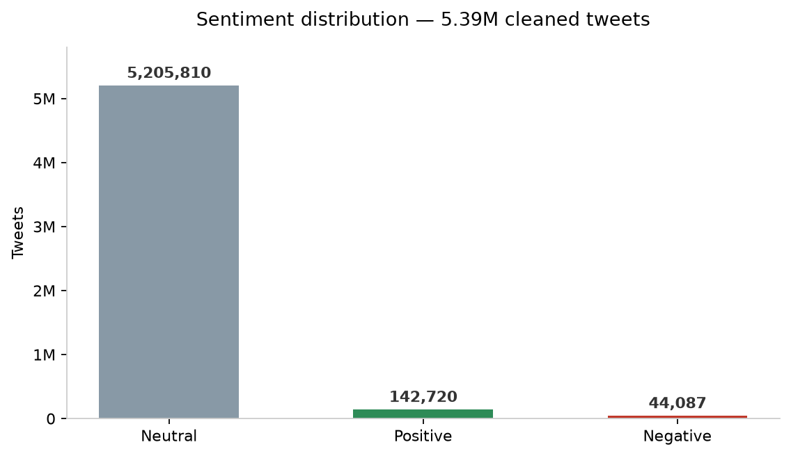
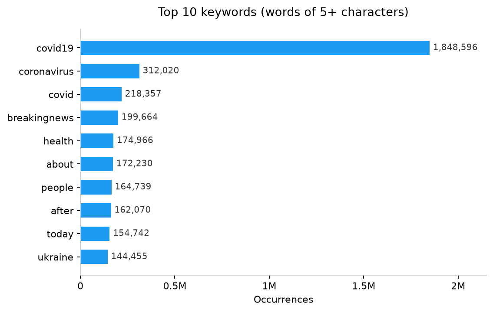

# Twitter Sentiment Analysis at Scale with PySpark


[](LICENSE)

Distributed sentiment analysis of **18.6 million tweets (~14 GB)**, processed end-to-end on an AWS EMR cluster with PySpark: ingestion from S3, distributed text cleaning, sentiment labeling, and a Spark MLlib classifier.

## Pipeline



## Dataset

Two merged sources totalling ~14 GB (not included in this repository due to size):

| Source | Format | Content |
| --- | --- | --- |
| WHO / COVID-19 tweets | 3 CSV files | Tweets mentioning the World Health Organization and COVID-19 |
| US news tweets | JSON | Tweets from US news accounts |

## Approach

1. **Ingestion** — the four raw files are read from S3 into Spark DataFrames and merged on the tweet-text column.
2. **Cleaning** — a chain of distributed transformations: drop nulls and duplicates, strip URLs, line breaks, and `RT @user:` prefixes, de-duplicate again (retweets collapse onto the original tweet once the prefix is gone), lowercase, remove punctuation and stop words.
3. **Labeling** — the corpus has no ground-truth labels, so TextBlob assigns each tweet a polarity score in [-1, 1], bucketed into Negative / Neutral / Positive (weak supervision).
4. **Classification** — a TF-IDF + multinomial Naive Bayes model (Spark MLlib) is trained on the TextBlob labels with a 70/30 split, so new tweets can be scored natively in Spark instead of through a slow Python UDF.



About two thirds of the raw corpus turned out to be duplicate rows within and across the merged sources — cleaning matters at this scale.

## Results

**Sentiment distribution** — the corpus skews heavily neutral: WHO and news accounts mostly publish factual, report-style tweets, and the ±0.5 polarity cut-offs only let strongly polar language out of the Neutral bucket.



**Top keywords** — COVID-19 vocabulary dominates, consistent with the WHO-centric sources:



**Classifier metrics** (held-out 30% split, ~1.6M tweets):

| Metric | Score |
| --- | ---: |
| Accuracy | 79.6% |
| Weighted precision | 95.4% |
| Weighted recall | 79.6% |
| Weighted F1 | 86.0% |

With 96.5% of tweets labeled Neutral, these weighted metrics are dominated by the majority class — see [Limitations](#limitations--future-work) for an honest reading.

## Repository structure

```
├── assets/                    # charts generated from the recorded EMR run results
├── notebooks/
│   └── twitter_sentiment_analysis_emr.ipynb   # original cluster run, outputs preserved
├── src/
│   ├── text_cleaning.py       # pure cleaning rules — no Spark dependency, unit-tested
│   ├── pipeline.py            # distributed cleaning + TextBlob labeling
│   ├── train_classifier.py    # TF-IDF + Naive Bayes as a Spark ML Pipeline
│   └── run_pipeline.py        # CLI entry point
├── tests/
│   └── test_text_cleaning.py
├── requirements.txt
└── pyproject.toml
```

The notebook is the original EMR run with its outputs preserved. The `src/` package is the same logic refactored afterwards into reusable, tested modules — it also fixes a subtle train/test leak from the notebook by fitting the IDF stage inside a Spark ML `Pipeline` on training data only.

## Getting started

Requires Python 3.9+ and a JDK (8/11/17) for local Spark.

```bash
pip install -r requirements.txt

# Clean, label, and train on any CSV with a tweet-text column
python -m src.run_pipeline --input path/to/tweets.csv --text-column text --train
```

If you collect fresh X data with Xquik, normalize the exported CSV before
passing it to the Spark job:

```python
import pandas as pd

from src.xquik_export import normalize_xquik_export

df = pd.read_csv("xquik-export.csv")
normalize_xquik_export(df).to_csv("data/xquik-tweets.csv", index=False)
```

The helper accepts common text column names such as `text`, `tweet`,
`tweet_text`, `full_text`, and `content`, drops empty rows, and keeps any
engagement columns for later analysis.

Run the unit tests:

```bash
pip install pytest
pytest
```

The full 14 GB dataset was processed on an AWS EMR cluster (PySpark kernel via Livy); for datasets that fit on one machine, the CLI above runs on local Spark as-is.

## Limitations & future work

- **Weak supervision, not ground truth** — labels come from TextBlob, a rule-based scorer, so the classifier learns to imitate TextBlob rather than human judgment. Validating against a hand-labeled sample is the right next step.
- **Class imbalance** — 96.5% of tweets are Neutral, so a majority-class baseline would beat the classifier on raw accuracy. Per-class metrics and rebalancing (e.g. undersampling Neutral) would give a truthful picture of minority-class performance.
- **Strict polarity cut-offs** — ±0.5 pushes almost everything into Neutral; conventional cut-offs (±0.05–0.1) would produce a more informative distribution.
- **Language mix** — TextBlob scores English only; non-English tweets in the corpus (e.g. Spanish) score ~0 and inflate the Neutral bucket. Language detection and filtering would help.
- **Feature space** — 1,000 hashed TF-IDF features is small for a 5M-tweet vocabulary; a larger feature space and stronger models (logistic regression, linear SVM) are worth comparing.
- **Stop words** — the custom 29-word list should be replaced with Spark's `StopWordsRemover` and its full English list.

## License

[MIT](LICENSE)
